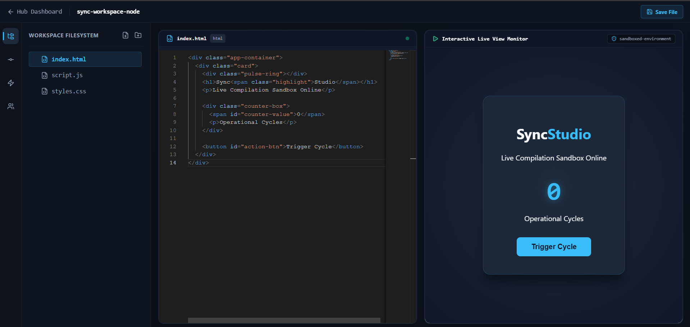

# SyncStudio

A collaborative browser-based development workspace designed for real-time **HTML, CSS, and JavaScript** development. SyncStudio enables multiple users to work together on the same project simultaneously while providing live code synchronization, instant preview rendering, version history management, and project collaboration tools.



---

## Features

### Real-Time Collaboration

* Multi-user collaborative editing
* Instant code synchronization across connected clients
* Live workspace updates using WebSocket communication
* Shared project environment for team development

### Intelligent File Management

* Hierarchical file and folder structure
* Create, rename, organize, and delete project resources
* Interactive file explorer with workspace navigation
* Support for HTML, CSS, and JavaScript project files

### Live Preview Engine

* Real-time rendering of HTML, CSS, and JavaScript
* Automatic preview updates while coding
* Sandboxed execution environment using iframe isolation
* Error-safe client-side runtime execution

### Version Control & Recovery

* Project version snapshots
* Commit-based workspace history
* Restore previous project states
* Collaborative change tracking

### Activity Monitoring

* Workspace activity feed
* Collaboration event tracking
* Project operation logs
* Team action visibility

### Authentication & Security

* JWT-based authentication system
* Protected API routes and middleware
* Secure workspace access control
* Authorized project collaboration

## Tech Stack

### Frontend

* React
* Vite
* Tailwind CSS
* Monaco Editor
* Socket.IO Client
* React Router

### Backend

* Node.js
* Express.js
* MongoDB
* Socket.IO
* JWT Authentication

## Project Architecture

### Client Application

The frontend provides:

* Monaco-based code editor
* Real-time collaboration interface
* File explorer
* Live preview environment
* Version management dashboard
* Activity monitoring panels

### Server Application

The backend manages:

* Authentication and authorization
* Project management
* File operations
* Version storage
* Real-time socket communication
* Collaboration events

## How It Works

1. Users create or join a project workspace.
2. Project files are synchronized across connected collaborators.
3. Code changes are transmitted through WebSockets in real time.
4. HTML, CSS, and JavaScript files are compiled into a sandboxed preview environment.
5. Version snapshots can be created and restored when required.
6. Activity logs keep collaborators informed about workspace events.

## Installation

### Clone the Repository

```bash
git clone <repository-url>
cd SyncStudio
```

### Install Dependencies

#### Client

```bash
cd client
npm install
```

#### Server

```bash
cd server
npm install
```

## Environment Variables

Create a `.env` file inside the server directory.

```env
PORT=5000
MONGO_URI=your_mongodb_connection_string
JWT_SECRET=your_jwt_secret
CLIENT_URL=http://localhost:5173
```

## Running the Application

### Start Backend Server

```bash
cd server
npm run dev
```

### Start Frontend Client

```bash
cd client
npm run dev
```

### Open in Browser

```text
http://localhost:5173
```

## Future Enhancements

* Integrated terminal support
* Project deployment pipeline
* AI-assisted coding features
* Team permissions and roles
* Project templates
* Multi-language support
* Cloud workspace synchronization

## License

This project is developed for educational and portfolio purposes.
